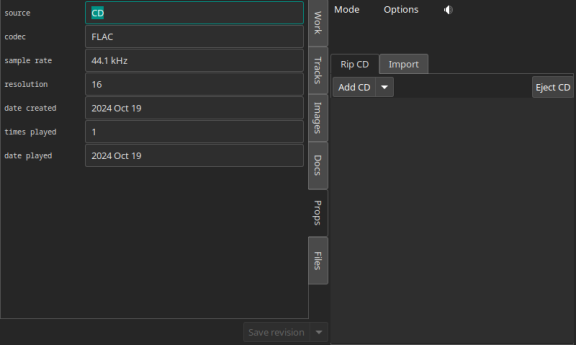

.. index:: single: mode; edit
.. _edit-mode:

Edit Mode
=========

Essential reading
-----------------

:ref:`Introduction<edit-introduction>` (paragraph 1)

:ref:`Revising<edit-revising>` (paragraph 1)

:ref:`Ripping and importing<edit-creating>` (the first paragraph of each of the four steps)

.. _edit-introduction:

Introduction
------------
Edit mode can be used either for revising an existing work or creating a new one. The panel on the left is used for specifying the metadata and the panel on the right is used for obtaining metadata and sound data.

Once you start using Edit either to revise an existing work or to create a new one, Wax reserves Edit mode for the work that you are creating. If you leave Edit mode -- to select and play another work, perhaps -- nothing will have changed when you return to Edit mode. Normally, Wax does not unlock Edit mode until you save your work. If you choose to abandon your work without saving it, the :ref:`Clear option<delete-options>` will remove all of your changes since the last save (or everything, if you never saved) and unlock Edit mode.

.. index:: single: edit; save button

Save button
-----------
The Save button is a "double button". It has two functions available. The down arrow on the part of the double button to the right is used for choosing the function. Wax tries to anticipate the correct function and it sensitizes or desensitizes parts of the double button to forbid operations that do not make sense. Thus, when you enter Edit mode with a work selected, Wax anticipates that you are going to want to save a revision, so the button is set to "Save revision". If you actually want to save a new work, use the down arrow to select "Save new" and then click the left part of the button. When you are creating a new work, the Save button is set to "Save new". The "Create" button works in the same manner. Its alternative function is "Add". Details appear :ref:`below<edit-add-cd>`.

The Save button becomes sensitive when the current state of Edit mode is savable. When you are creating a new work, it is savable when the specification is complete. When you are revising an existing work, it is savable when you have made a change. Possible changes include:

* Change genre
* Add/delete/modify work/track metadata
* Rearrange tracks
* Add/delete track groups
* Add/delete/rearrange images
* Add/delete documents
* Add/delete/modify properties

.. index:: single: edit; revising metadata
.. _edit-revising:

Left panel (revising and creating)
----------------------------------

You will use the left panel when revising or creating a work. When creating a work, the forms on the left panel start out blank. In most cases, Wax will fill in the forms automatically when you start ripping a CD or when you import files. You have the opportunity to polish the metadata by interacting with the forms.

To revise an existing work, first select it (in :ref:`Select mode<select-mode>`) and then switch to Edit mode. When you switch to Edit mode with a work selected, Wax enters all the metadata in the forms on the left panel. When you make a change, Wax displays a message briefly describing the change.

.. index:: single: edit; work metadata
.. _work-metadata:

Work
++++

.. image:: figures/edit-work.png
    :align: center

Notice that primary work metadata (the metadata that appear in Select mode) have two entries. One is for the long form and the other the short form. The width of the entry for the short form reflects the current width of the colum in Select mode, so you can tell immediately whether the string that you entered will fit. (If it does not fit, the text will be truncated with ellipsis.) Notice when you enter something in an entry for the long form that Wax will guess that you want the last name as the short form. Be aware that Wax sorts metadata based on the short form (see :ref:`guidelines<guidelines>` below).

Also notice that entries have arrows to their left (the "name group" feature). Click on these to open additional entries for the given metadata key. For example, a key called "artist" takes the name of one artist, by default. If a work has two or more, use the arrow to open additional entries.

A context menu (right click) offers several options for modifying an entry. If you click in a short metadata entry, one of these options is "Use long". It will replace the value for the short metadata with the value already entered for the long form. "Reverse" applies to long entries with a comma. Sometimes, metadata optained from the web will specify names as "Last, First Middle". Reverse transforms the entry to "First Middle Last". If there is more than one comma, Wax reverses around the first comma on the left. "Swap with" makes it easy to move values  to the correct field by swapping the value in a given field with the one that you select in the menu.

    .. TIP::
        **Page Down** opens additional entries (but you have to be in the line of an entry with the arrow). **Page Up** closes them. You do not actually have to close additional entries if you decide not to use them because Wax ignores empty entries.

.. _secondary-work-metadata:

You specify secondary work metadata (metadata that appear only in Play mode) using the fields below the ones for the primary work metadata. They work in the same manner as the fields for the primary metadata, but there is only a long form (because there is always room in Play mode for the entire value).

.. _permanent-secondary-metadata:

Permanent secondary metadata keys are specified in the genre template. They appear automatically in Edit mode. You are not required to assign a value to these keys, but the requisite fields will be available to you automatically.

.. _nonce-metadata:

Nonce metadata are metadata that apply to specific works. For example, a work of Peter and the Wolf may need a place to put the name of the speaker. Click on +Nonce to open an additional field. It works in the same way as the other fields except that you also specify the key (e.g., "speaker").

    .. WARNING::
        Keys for metadata must be unique. Wax already enforced this requirement when you specified primary and secondary metadata fields while creating a new genre in WaxConfig. However, you have another opportunity to violate this edict when creating nonce metadata. If you do, Wax will enforce the edict when you save by merging the values for any new nonce metadata fields into preexisting metadata fields with the same key.

.. _autocompletion:

Wax provides automatic completion for values you type into permanent work metadata. Possible completions appear on a popup menu. As you type additional characters, Wax winnows the list of completion options. Certain keys (composer, conductor, orchestra, and others) have predefined completion values (and you can :ref:`define your own completion values<completers-files>` for any key). Note that automatic completion can be a convenient way to deal with unicode values. If you save a work with a name unknown to Wax, it will ask whether you want to add the name to the completers file for the corresponding key. It will also tell you how many names are already in the file. If the file gets too large, you might find that entering a value gets sluggish.

.. index:: single: edit; track metadata
.. _edit-track-metadata:

Tracks
++++++

.. image:: figures/edit-tracks.png
    :align: center

To edit track titles, click once to select the track and again to open it for editing. When you are done, click outside the track or type enter. Type Esc to leave Edit mode without saving the changes. For track titles, it is not possible to drag selections (selecting the text on the right panel closes the track), so you must use copy-and-paste.

You can reorder tracks by dragging them to the desired position. Clicking on the up/down arrow at the right end of the item avoids activating edit mode. You can reorder tracks within a track group as well, but they must remain in the track group. You are allowed to drag a track group, but you may not drag either a track or a track group into a track group.

.. _secondary-track-metadata:

Secondary track metadata
~~~~~~~~~~~~~~~~~~~~~~~~

.. image:: figures/edit-tracks-secondary.png
    :align: center

When entering track metadata, you will typically enter the title of the track as the primary track metadata (the track metadata that appears in Select mode). Sometimes, you will want to include additional metadata. For example, for an album of showtunes, you will enter the title of the song as the primary track metadata, but you might also be interested in the names of the performers, the composer and lyricist, and the date of the performance (as shown in the figure above). When these values vary on a track-by-track basis (as they do in the recording shown), they belong in track metadata rather than the work metadata. You could lump all the information in the primary track metadata with suitable formatting, but then you risk obscuring the information essential to selection (e.g., the title of the song). Separating the secondary information allows you to prioritize the information essential to selection while still providing valuable information during play.

To enter secondary track metadata, first select the track. When you select a track, fields appear at the bottom of the panel. These fields allow you to specify the key and the value for additional metadata. To open fields for additional metadata, click the right arrow at the start of the line. If the cursor is in a secondary track metadata field, you can also type Page Down to open another field (or Page Up to close one). When specifying the key, Wax presents automatic completions for common values. For example, Wax will offer the completion "composer" after you type "c" in the key field. Type tab to accept the completion and move to the value field. You can modify :ref:`the list of completions<secondary-track-metadata-completers>` in WaxConfig.

.. _create-track-groups:

Track groups
~~~~~~~~~~~~

Wax makes it possible to group tracks to highlight a relationship finer grained than the title of the work. In an opera, for example, the work is the title of the opera, but track groups can specify the tracks in each act. To group tracks, sweep the range of tracks you want while holding the mouse button, or select the first track in the group and then select the last track in the group while holding the shift key. Once you have specified a group, fields appear at the bottom of the panel. The first contains the prefix common to all the tracks in your selection. When you click the Group button, Wax will remove that string from each track title in the group and it will become the title of the group. Wax displays the common prefix that it detected so that you can adjust the string that Wax will extract when you click Group.

MusicBrainz and ID3 typically include the work title along with the track title, so track titles usually look something like this: "Symphony No. 15 in A Major, Op. 141: I. Allegretto", "Symphony No. 15 in A Major, Op. 141: II. Adagio", and so on. The common prefix in this case is "Symphony No. 15 in A Major, Op. 141". When Wax removes the common prefix, it also removes any residual punctuation (the ":" in this case) and spaces. Numerals specifying the order of tracks are superfluous because the positions of tracks in the list determine their order. If the tracks are named "Ballade No. 1, Ballade No. 2, and so on, Wax will remove "Ballade" from the track titles and intentionally leave "No." behind so that the track titles become "No. 1, No. 2, ...".

To ungroup a track group, first select the group. An Ungroup button will appear along with an entry containing the string which Wax will restore to the title of each track (with a space after it). Adjust it, if necessary, before clicking Ungroup.

    .. TIP::
        The group/ungroup functionality can be useful when importing even when you do not need to create a group. In the example above, MusicBrainz and ID3 provide the title of the work, "Symphony No. 15 in A Major, Op. 141" redundantly because it appears in the title of every track. Retaining that information in the track title wastes screen space, risks crowding the unique part of the track title off the screen, and obscures the useful information about each track. By creating a track group, Wax clarifies the salient track information. However, if "Symphony No. 15 in A Major, Op. 141" is the only work on the recording, then creating a group with that title duplicates information in the work metadata. There is a trick for using the group feature to tidy the track titles and extract the work title to the correct work metadata field. First select the four movements of the work and then group them. As described above, Wax will create a group whose title is the desired work title. In the process, it also copies the group title to the clipboard. Next, clear the common prefix field by clicking the delete button in the field and then Ungroup. Now, there is no group and the track titles contain only the unique information associated with each track. Finally, go to the Work tab, position the cursor in the work field, clear it (if necessary), and select Paste on the context menu (or type ctrl-v). Wax will paste what used to be the group title into the work field. Using this procedure, you can tidy the track titles and specify the work title in only five clicks!

    .. TIP::
        If you want to relocate a group of related tracks (e.g., the four movements of a symphony), form a track group (assuming that they are not already in one), move the track group, and then ungroup them.

Note that it is not permitted to have track groups within groups. If you select a range of tracks that includes a track group or is inside a track group, the group controls will not appear.

.. _edit-keyboard-shortcuts:

Keyboard shortcuts
~~~~~~~~~~~~~~~~~~
You can use keyboard shortcuts to speed the process of entering track metadata. Select the first track and open it for editing. Type in the metadata, then type enter and the down arrow. Hitting enter closes the field and the down arrow moves to the next track. Now type enter again and the next track will open for editing.

    - **down arrow** moves to the next track
    - **enter** opens or closes a track
    - **ctrl-k** toggles visibility of the unicode keyboard

.. index:: single: edit; images
.. _images:

Images
++++++

.. image:: figures/edit-images.png
    :align: center

The third page in Edit mode is for specifying images. Wax provides four ways to obtain images: download from the cloud (for CDs only), extract images embedded in the sound files (for files only), paste from the clipboard, and read from a file. All candidate images are stored in an image viewer. The viewer makes it possible to screen images to decide which to keep with the work. When there are multiple images, a stack of thumbnails appears to the left of the main image. The first thumbnail is the one that displays first in Play mode. The thumbnails can be rearranged as desired and individual thumbnails can be deleted using the Delete button. Wax saves all images in the image viewer to the work when you click "Save new" or "Save revision".

When you enter Edit mode with an existing work selected, Wax will populate the image viewer with the images that you saved previously. If you actuate any of the buttons for importing images to the image viewer, you will be augmenting the set of images already present. You might, for example, actuate the download-from-the-cloud button to see whether better images or additional images (e.g., the rear cover) are available. It is likely in this scenario that you will end up with duplicates, so just delete the ones that you do not need before you click "Save revision".

Paste
~~~~~

If you find appropriate cover art using another application (e.g., the browser), copy it to the clipboard and then paste it to Wax using the Paste button.

Download from the cloud
~~~~~~~~~~~~~~~~~~~~~~~

MusicBrainz usually provides links for CDs to cover art at Cover Art Archive and Amazon. Click the download-from-the-cloud button to acquire these images. Wax automatically requests them as one of the operations that it performs when you click Create.

.. _coverart-button:

.. index:: single: edit; documents
.. _documents:

Documents
+++++++++

.. _doc-import-button:

The fourth page in Edit mode is for specifying documents. The Import button becomes sensitive when you select a PDF in the filechooser. After you import the PDF, its name is visible in the list near the top of the Docs page and the contents appear below that. You can step through the contents of the PDF using the next and prev buttons at the top left of the page.

.. image:: figures/edit-docs.png
    :align: center

.. _edit-properties:
.. index:: single: edit; properties

Properties
++++++++++

Properties are also metadata, but unlike the metadata that we discussed above, the same properties appear in every work regardless of genre.

.. _automatic-properties:

Wax maintains several properties automatically. It assigns a value to date created when you save a work, and it updates date played and times played when you play a work. It assigns remaining values when you start ripping a CD or when you import files as long as the value is relevant, determinable, and rational. (Sometimes tags contain invalid values such as a sample rate of 0.) For files, Wax attempts to populate "source" with the web site from which a file was purchased. It identifies the web site by searching for a URL among the tags. If it fails to find one, it will specify "File". The source for a rip is always "CD". Although Wax will set and update these values automatically, you are still allowed to edit them yourself.

In addition to the automatic properties, you will also see here any user properties that you defined in :ref:`WaxConfig<user-properties>`.

Wax displays properties in Play mode on the :ref:`Props page<play-props-page>`.

.. index:: single: edit; files

Files
+++++

.. image:: figures/edit-files.png
    :align: center

The Files panel provides information about the files comprising the work. The first line (in blue) is the unique number (UUID) assigned by Wax. The sound files and metadata are all stored in directories with the UUID. The next lines are the names of the actual sound files; they correspond to the tracks of the original CD that you ripped or the tracks that you imported. The track listing will include *all* the tracks from the corresponding CD. The tracks on the work currently selected will appear in white and any others in gray. You will also see image files and document files if any of these things are associated with the work. If the work encompasses more than one CD, then you will see additional blocks with appropriate disc numbers. The listing concludes with the total size of all the sound files.

    .. TIP::
        Clicking the button alongside the UUID will copy the UUID to your clipboard. If you ever need to use the file manager to examine the sound file directory, you can navigate to the sound directory and then paste the subdirectory name (the uuid) into the navigation entry.

.. _part-file:

    .. TIP::
        If a rip is underway, you will see a sound file with a .part extension. On completion of the rip, the sound file is renamed to one without the .part extension.

.. index:: single: edit; ripping and importing
.. _edit-creating:

Right panel (ripping and importing)
-----------------------------------

When you first enter Edit mode, you are in "Rip CD" mode by default (obtain sound data from a CD). The other mode is "Import" (import sound data from files). Use the tabs on the panel below the global controls to select the desired mode.

Creating a new work involves four steps:

- **Select the genre**. Select the genre for the new work. In general, genres have different sets of primary and secondary metadata fields. If you change the genre after entering some metadata, Wax will preserve metadata by moving it as necessary between primary and secondary or by creating nonce metadata. However, choosing the correct genre before initiating an operation permits Wax to extract metadata more effectively (see :ref:`below<genre-first>`).

- **Rip the CD or import files**. Click the appropriate tab on the right panel depending on whether you want to rip a CD or import files. On the Rip CD page, you will click the Create button to initiate a rip. It becomes sensitive when you insert a CD in the optical drive. On the Import page, you will click the Import button to initiate an importation. It becomes sensitive when you select at least one sound file in the file chooser.

  On pressing either the Create or Import button, Wax will erase any metadata that might be present on the left panel and it will sensitize the forms. It will attempt to fill those forms with metadata that it finds. The forms are insensitive until you initiate an operation because any values that you might otherwise have entered would be destroyed on initiation of the operation.

  When you are ripping, Wax replaces the control panel with a panel containing a progress bar for monitoring progress through each track and an :ref:`Abort button<abort-button>` to abort ripping. It fills the form in the right panel with the raw metadata that it finds at MusicBrainz. Import happens almost instantaneously, so there is no need for a progress bar. Wax fills the raw metadata area with metadata that it finds in tags in the sound files.

  When you start creating a new recording, Edit mode is dedicated to that recording. You can still return to Select mode, select a work, and view its metadata in Play mode. You can even play a work already in your collection. However, when you return to Edit mode, you will not enter revise mode on any selection, as described :ref:`above<edit-revising>`. Instead, you will find yourself back in create mode with any metadata that you might have entered for the work that you are currently creating.

.. _enter-metadata:

- **Enter the metadata**. The steps required to enter the metadata depend on the degree of success Wax had in retrieving metadata automatically. Sometimes, Wax succeeds in finding all the metadata for both the work and the tracks. It might even have found the cover art automatically. If so, you are ready to save. If not, you will need to intervene.

  For CDs, Wax obtains metadata from MusicBrainz. For imports, Wax obtains metadata from tags in the files. In either case, Wax presents all the metadata that it finds in the raw metadata panel on the right. If necessary, drag the divider at the top of that panel to expose more of the raw metadata.

.. _genre-first:

  Wax uses a learning algorithm to map raw metadata values automatically to appropriate fields on the left. For the best results, it is important to select the appropriate genre before initiating the rip or import so that Wax knows what names to look for. For example, if the genre has a field for "conductor", Wax will know to map the name "Seiji Ozawa" to that field. If you are in a genre that does not have a field for conductor, it will ignore that name. The learning algorithm also makes it possible to standardize spelling, particularly in the case of transliterations. For example, if Wax learned the name Sergei Rachmanino\ **ff**\ , it will recognize Sergei Rachmanino\ **v**\  as equivalent and put the learned name in the composer field.

  If Wax fails to recognize a name, you can select the name in the raw metadata panel and drag it to the appropriate field manually. Start by selecting the desired string. You do not have to be precise when selecting the string as Wax will automatically widen the selection to encompass full words (we call this feature "sloppy select"). Once you have made your selection, you can drag it to the appropriate entry for work metadata. You can also use standard cut-and-paste commands:

  - ctrl-c to copy the selection to the clipboard
  - ctrl-v to paste it

  If an appropriate value is not present in the raw metadata, then you will have to type it in (see :ref:`Work metadata<work-metadata>` and :ref:`Track metadata<edit-track-metadata>` below) or you will use the trick described in the tip in File mode :ref:`below<import-trick>`. When you save the recording, Wax will ask whether you want it to remember the name so that it will recognize the name in the future.

  .. index:: single: edit; raw metadata panel

  When Wax finds metadata at MusicBrainz, you will find the track entries already filled in. When Wax fails to find metadata for a CD on the Internet, it still knows how many tracks are on the CD because that information is in the table of contents on the CD itself. In that case, it creates entries for the appropriate number of tracks and gives them default names (Track1, Track2, etc.). When importing, the track titles are always present in tags because the relevant tag is required.

.. _unicode-keyboard:

    .. TIP::
        There are two methods for entering unicode characters. The first always works, as long as you know the unicode code point. You use a special sequence of keystrokes to signify unicode and then the appropriate code. Follow the directions in the Appendix (:ref:`unicode<entering-unicode>`).

        The other method is to use the unicode keyboard. It resides on a popup window. The item "Show unicode kbd" in the Options menu toggles visibility, as does the keyboard shortcut ctrl-k. If you can find the unicode character you need on this panel (there are 171 characters), click on it to make it appear at the cursor. The cursor will already be where you want the character to appear normally because you were probably already typing other characters. If not, be sure to position it first. Note that you can use the unicode keyboard for track metadata as well as for work metadata. Also note that the unicode keyboard also copies the character to the clipboard, so if you need the character again (e.g., for the short form), you can just type ctrl-v.

- **Save the work**. Once you have entered the metadata, you are ready to create a new work by clicking the "Save new" button. Note that Wax will permit you to save the metadata as long as you have specified the primary metadata and you have ticked at least one track for saving. The first time you save metadata after ripping a CD, you *must* create a new work (Wax does not permit you select "Save revision"). However, after you have created at least one new work, *you* decide whether subsequent changes were meant to revise the most recent work ("Save Revision") or create a new one ("Save new").

.. _save-work:

    .. WARNING::
        Once you have saved the work, Wax automatically selects it. You can go to Select mode, put the work in the play queue, and initiate play, but beware if the rip operation is still underway because Wax cannot play what has not been ripped. Only tracks for which sound files exist *at the time you queue a selection* will play. Any tracks for which sound files do not yet exist will not play even if the ongoing rip produces a sound file before play attempts to play it. If the first track in a set does not have a corresponding sound file when you enqueue the set, you will hear a warning sound when you attempt to play the set and play will immediately terminate. Otherwise, Wax will play every track in the set for which a sound file exists at the time of enqueuing and then quit.

    .. WARNING::
        Before leaving Edit mode, always look at the Save button. If it is sensitive, something is savable. You probably want to click the Save button before you leave. If you do not save, Edit mode remains locked to the recording, so when you return to Edit mode you will have another opportunity either to save or to clear the work.

  When creating a new work, the Save button becomes sensitive when the work is savable. You do not have to fill in everything to create a new work. At a minimum:

  - Specify the primary work metadata.
  - Tick at least one track as playable.

  You do not even have to enter the track metadata because in the worst case Wax provided default track titles. Everything that you did not specify you can do later (in revise mode). Normally, though, you will enter all the metadata when you create the new work.

Ripping
+++++++

Next, we will look more closely at the steps involved in gathering all the metadata.

.. _multiple-works-one-cd:

Multiple works from one CD
~~~~~~~~~~~~~~~~~~~~~~~~~~

The track page has a column of checkboxes on the left. They are used to select the tracks that you want to include in the new work. Usually you will want to include all the tracks, so Wax selects them by default. Sometimes, you will want to specify fewer. One possibility is that you are not interested in including part of a CD in your collection. A more likely possibility is that there is more than one work on the CD. For example, one CD might have both Symphony No. 29 and Symphony No. 38 by Mozart. You should make separate works for these two works because it will be easier to find them that way. Wax makes it possible to create one Wax work with a name group for more than one artistic work (by using the right arrow to create additional entries for additional works). However, when you sort by work, Wax will sort by the first work in the name group. Additional artistic works in the same work (Symphony No. 38, in this example), will appear with Symphony No. 29, so it will be out of sequence with respect to the other symphonies by Mozart. Accordingly, you usually want to create separate works for distinct works (:ref:`work orientation<work-not-track>`).

To create separate works, first select the tracks for the first work. When you click "Save new", only they will be designated "playable". To save the second work, change the work metadata appropriately, then change the track selection to the second work. The selector double button at the top left of the Tracks page makes it easy to reverse the selection of tracks by selecting the Reverse option on the dropdown menu. Before you click save, examine the Save button. It is set to "Save new" initially because your purpose is to create a new work. Once you save the first work, though, Wax will set the function to "Save revision" because usually any subsequent save is for saving changes that you made to the metadata for the work that you just created. However, if you are actually creating an additional work, change the function back to "Save new".

When you create multiple works from a single CD, note that each work has different work metadata and different track selections, but they all share the same cover art, documents, and properties.

.. _edit-add-cd:

Single work from multiple CDs
~~~~~~~~~~~~~~~~~~~~~~~~~~~~~

You have just learned how to create multiple works from a single CD. Next we will consider the opposite case: one work from multiple CDs. Some works (e.g., most operas) are too long to fit on a single CD. Nevertheless, we want to store them in Wax as a single work. Start by entering the metadata for the first CD as described above. Insert the second CD and press the "Add" (*not Create!*) button. The tracks from the second CD will appear below the ones from the first CD. Wax will not alter the work metadata (as it would if you clicked Create). If you used the "Save new" button after ripping the first CD, you have already created the new work. After adding the tracks from the second CD, be sure to set the Save double button to "Save revision". If you did not save after ripping the first CD, then use "Save new". Just remember to use "Save new" the first time you use the save button for the work and *only* the first time.

Multiple works from multiple CDs
~~~~~~~~~~~~~~~~~~~~~~~~~~~~~~~~

You may also encounter a multi-CD set with multiple works, e.g., various works by one composer spanning multiple CDs. The most straightforward way to handle this situation is through a combination of the techniques in the previous two sections. Start by clicking Create for the first CD to rip its tracks. Then click "Add" for subsequent CDs to rip their tracks. Select the tracks that correspond to the first work. Enter the appropriate metadata for the work and save a new work. Select the tracks for the next work, enter its work metadata, and save another new work. Continue until you have created new works for all the works on all the CDs. The procedure is the same as the one for creating multiple works from a single CD except that you use "Add" to add tracks from all CDs subsequent to the first.

    .. CAUTION::
        Wax will permit you to treat each CD in the set separately (click Create with every CD in the set rather than Create for the first followed by "Add" for the rest). If you do, Wax will have no way to know that the works came from the same CD set. The works that you create will work fine in every way except one: A :ref:`sibling search<sibling-search>` for one of the works from the set will not find the other works in the set. If sibling search is not important to you, feel free to use this procedure rather than the one involving "Add". Also note that you will have to deal with the cover art for each CD rather than dealing with it once for the entire set. Obviously, if you are creating a single work from multiple CDs, you must use "Add" rather than Create.

.. _reorder-tracks:

Re-rip
~~~~~~

If anything goes wrong when ripping a CD, you can click "Add" with the appropriate CD in the drive. Wax will repeat the process of ripping tracks for that CD without changing the work metadata.

.. _abort-button:

Abort
~~~~~

When you are ripping a CD, a button appears for aborting the rip. Clicking the button halts ripping immediately. It also triggers some cleanup. The nature of the cleanup depends on the nature of the rip, but the objective always is to assure that aborting a rip does not leave unclaimed sound files behind. Unclaimed sound files ("zombies") consume disk space but cannot be played because no work refers to them.

- If you are performing an initial rip of a CD that is not associated with any work, then clicking abort will cause Wax to delete any sound files already ripped and to clear any metadata.

- If you clicked Abort after initiating a rip to add a CD for the first time to a work, then Wax will delete all the sound files and any metadata associated with that CD (track titles and images), but it will leave other metadata.

- If you clicked Abort after initiating a rip using "Add" of a CD that you already ripped (you are reripping the CD), Wax will simply stop ripping.

Tagging
~~~~~~~

When you rip a CD, Wax will automatically add tags (Vorbis comments) to the FLAC sound files that it creates. The tags are:

- album
- artist
- title
- tracknumber
- tracktotal
- date
- asin
- discid
- musicbrainz_discid

It obtains values for these tags either from the table of contents of the CD or from MusicBrainz.

When you import sound files, they presumably already have tags.

.. _file-mode:

Importing
+++++++++

Import is used for importing sound files. You might have obtained the sound files by purchasing tracks from a web store, by ripping an LP, or by ripping on your desktop system (see :ref:`tip<import-trick>`). Whatever their provenance, the first step is to copy them to the transfer directory of the Wax Box. Use your file browser -- e.g., Windows Explorer on a Windows platform or Finder on an Apple platform -- to navigate to your network, then to your Wax Box, then to the transfer folder. You might want to create a subfolder in which to store the sound files for a particular recording so that you can easily distinguish them.

.. _file-chooser:

Once you have copied the sound files to the Wax Box, you will find them using the file chooser. Navigating in the file chooser requires the use of buttons at the bottom of the panel. Their functions are: move to the parent folder, create a subfolder of the current folder, and delete the selected file or files. If the folder is empty, the delete button will delete the current folder and move to the parent folder.

.. image:: figures/edit-import.png
    :align: center

To create a work from sound files that you import, start by selecting the appropriate genre. Next, select the files in the file chooser that you want to import. The Import button becomes sensitive when you select at least one sound file. Click it to effect the import. Wax copies the selected tracks into the sound archive. If there are tags in the sound files (there usually are), Wax will attempt to assign their values to the appropriate metadata fields in Wax. As in CD mode, Wax will put the tags in the raw metadata panel so that you can examine them.

Normally, you will import all tracks in a single operation using the Import mode of the double button. However, it is also possible to *add* tracks using the Add mode of the double button. As in CD mode, adding tracks leaves the work metadata unchanged. Wax appends tracks to the end of the list of tracks whether the original tracks got there by ripping or importing.

.. _edit-liner-notes:

You are allowed to include files of different types (sound, image, or document) in your selection. Wax will do the right thing with the files depending on their type. A message appears when you select files telling you what file types are in your selection.

If you are uncertain about the content of a file, right click and select Open on the context menu to open it in a handler (see the :ref:`tip<openable-files>` below for file types that are openable). An item in the list of files is rendered in italics when Wax does not recognize the file type or if something is wrong with the file (the header might be invalid or the encoding might be unsupported). If your selection encompasses one of these files, Wax will ignore it when you activate the import operation.

.. _openable-files:

    .. TIP::
        Wax has handlers for most file types that you are likely to encounter. Right-clicking on a file of a known type and selecting Open will open the file in the appropriate handler. The file types that Wax recognizes are most sound files (wav, flac, ogg, m4a, and mp3), jpg, pdf, and zip. Sound files play immediately using the default handler on your system. Opening a zip file starts an archive manager capable of extracting the files. This feature makes purchasing and importing downloads very convenient:  Make your purchase using a browser on the Wax Box. When you download your purchase, the browser will deposit it in the transfer folder. The tracks often arrive in a zip file. Open the zip file and then unzip the tracks into their own folder. Descend into the folder in the file chooser, select the tracks, and click Import.

.. _context-menu:

The context menu has three options: Open, Rename, and Delete. Opening a directory descends into it. Opening a file invokes the appropriate handler, as discussed :ref:`above<openable-files>`. Deleting a folder will also delete the contents of the folder, including any subfolders and their contents. Note that the delete button operates on whatever is selected, but the Delete option operates only on the item you click on.

.. _import-trick:

    .. TIP::
        As discussed :ref:`above<enter-metadata>`, Wax looks in MusicBrainz for metadata when you rip a CD. If Wax does not find metadata, one solution is to type it all in. However, typing in all the metadata is cumbersome, especially when the CD has track titles in a foreign language. File mode introduces another option: Rip the CD on your desktop system using a standard media player (e.g., Windows Media Player or iTunes) and then import to Wax. These players use commercial databases (Rovi and Gracenote) with nearly complete coverage as their source for metadata, so it is likely that they will have metadata for the CD even when MusicBrainz does not. The media player will tag the tracks, so Wax will recover the metadata when you import. You probably will want to make some adjustments, but usually this procedure will greatly reduce the amount of typing required.

Clean-up
~~~~~~~~

The tracks that you copy from your desktop system to the transfer directory consume disk space. If the transfer folder fills, it will be impossible to import additional works. Accordingly, you should delete the tracks after you finish importing them. There are tools for deleting the tracks both in Wax and in the file browser on your desktop system. To delete them using Wax, select the tracks that you just imported and then click the delete button at the bottom of the navigation panel. If you just deleted all the tracks in a folder, then click the delete button a second time to delete the folder and move to the parent folder. If all the tracks that you just imported reside in the same folder, you can use the context menu to delete that folder along with the tracks in just one click. You are now poised to begin the next import operation.

.. index:: single: edit; options menu
.. _delete-options:

Options
-------
In Edit mode, the Options menu offers two choices:

- **Show unicode kbd**: toggle the visibility of the :ref:`unicode keyboard<unicode-keyboard>`.
- **Query MB**: populate the raw metadata panel with metadata from MusicBrainz. Use this option if you have already created a work from the CD, but you want to improve or augment the metadata. It is also useful if accessing MusicBrainz failed and you want to try again.
- **Clear**: restore Edit mode to its last saved state (or to the state of the currently selected recording, if you changed the selection while editing).
- **Delete**: delete a work. If it is the last work created from the CD or import, then it also deletes all sound files, images, and documents.

    .. WARNING::
        You will not be asked to confirm a delete operation, so before actuating Delete, be sure of your intentions.

.. index:: single: edit; guidelines for creating metadata
.. _guidelines:

Guidelines for creating metadata
--------------------------------

- Select mode orders works according to the short-form of the metadata. Accordingly, you usually do not want articles. Think about how you usually refer to a work. For example, are you more likely to find the show you want to hear by looking under "The Fantasticks" or "Fantasticks"?  The long form should include the article.

- When creating the short form from a name, Wax will take the last name. Sometimes you might want something different. If you ever sort by conductor, are you going to look for "Karajan" or "von Karajan", "Waart" or "de Waart"?  Most people will probably prefer the first form in each case, even if they are technically incorrect.

- Try to be consistent in your style choices as consistency makes the presentation in Select mode neater and easier to read. For example, when do you use abbreviations (Op. or Opus, minor/major or min./maj.)?  When you abbreviate, do you include the period or not (Op. or Op). Where do you use commas (Op. 10, No. 2 or Op. 10 No. 2)?  If you are using Wax on a device with a small display, you probably should not spell out everything (not Opus 10, Number 2). Most people will probably prefer the first choice above for each of the dilemmas.

- CDs with filler pieces often create a quandary. For example, a CD of Tchaikovsky's Symphony No. 5 might include the Romeo & Juliet Overture. When you create a work of Symphony No. 5, will you include the overture or create a separate work for it?  If your collection includes many versions of the overture, you will probably want to catalog it separately so that you can easily survey all the versions to select the one that you want to play. If you are unlikely to have many versions of the filler piece, you might prefer to leave it with the symphony to minimize clutter in the list of works. Remember, though, that it is easier to lose pieces filed this way as they will appear only in the list of tracks (which appears only after you select a work) or in search results. A third possibility is to specify multiple works (click the arrow to open another field), but then the symphony will not appear in its proper place in the list of works of the same work (:ref:`work metadata<work-metadata>`). If you leave the filler with the symphony, create a :ref:`track group<create-track-groups>` for the symphony so the relationship of the movements is clear.

- A Recital is a collection of pieces by multiple composers. Chamber is for multi-movement works by one composer (e.g., a string quartet). Anthology is for collections of pieces by one composer that are not part of a single work (e.g., the Chopin Nocturnes).
