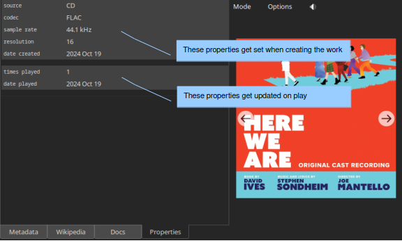

.. index:: single: mode; play
.. _play-mode:

Play Mode
=========

Essential reading
-----------------

:ref:`Introduction<play-introduction>`

:ref:`Metadata<work_metadata>` (first three paragraphs)

.. _play-introduction:

Introduction
------------
Use Play mode to see *all* the metadata associated with a recording, including the cover art.  Select mode presents only the metadata that are essential for making a selection (the "primary metadata").  To facilitate selection of the desired work, we want Select mode to present metadata for as many recordings as possible.  The best use of limited screen space is to present only primary metadata and to present the primary metadata in its short form (for example, "Mozart").  In Play mode, the limited screen space is available to display all the metadata for the selected recording.  You will see the primary metadata in its long form ("Wolfgang Amadeus Mozart"), the secondary metadata (any metadata not essential to making the selection), and the cover art.

You get to Play mode from Select mode using the Mode button in the control panel. However, the option for switching to Play mode is insensitive until you select a work. You can also double-click on a work in Select mode to switch to Play mode. This shortcut is available in the Selector, either Search mode, or the play queue.

.. index:: single: play; work metadata
.. _work_metadata:

Metadata
--------

The left panel on the Metadata tab has four regions.  The first two apply to the set and the second two to the current track. Each pair starts with a row that includes a progress bar. The progress bar at the top of the left panel provides a visual indication of progress through the set.  Remember that each set in the play queue corresponds to a work and typically specifies more than one track.  Thus, progress through the set is usually different from progress through the playing track (which is conveyed by the lower progress bar).

.. index:: single: play; track metadata
.. _track-metadata:

Below each progress bar is space for metadata.  The space below the progress bar for the set is for metadata related to the work.  The space below the progress bar for the track is the metadata for the track: the title of its track group (if any), metadata for the track group, the title of the track, and any metadata specific to that track.  You can use this space to convey information such as the names of special artists who appear only on one track or of the composer and lyricist who wrote the song.  Wax adjusts the size of this panel automatically to accommodate the track metadata.

Both progress bars have an associated button for viewing a time.  Clicking the button cycles the displayed time through time remaining, time elapsed, and total time.  The button to the far right of the set progress bar skips to the next set in the play queue.  The corresponding button for the track skips to the next track in the current play queue set. Click in the track progress bar to adjust the play time.  As a convenience, if you click *near* the beginning, Wax will jump to the beginning of the track.

The covers that appear at the bottom of the right panel depict the play queue.  Click on a cover to view the metadata for that recording. Note that the controls appear only when you select the first set in the queue -- the one that is playing (or stopped).

    .. WARNING::
        There is a potential source of confusion related to the visibility of the progress bars and controls.  Suppose that there is a set in the play queue.  If you select the same recording from the list of recordings *but with a different selection of tracks* and then switch to Play mode, the progress bars and controls will not be visible.  The difference in the set of tracks makes the recording that you just selected different from the one at the top of the play queue.  You can anticipate the result by observing that the set in the play queue is not selected when you make your selection in the panels on the left of Select mode.

    .. TIP::
        When you are in Play mode, you can use **Page Up** and **Page Down** to select the next or previous work in the list of recordings in Select mode.  **ctrl-Up** and **ctrl-Down** serve the same purpose; they are mainly for Apple users.

Wikipedia
---------

.. image:: figures/play-wikipedia.png
    :align: center

The Wikipedia page presents pages from Wikipedia related to the current work. The Search menu lists names in the metadata that also appear in Wikipedia (not necessarily in their own entry). The next/prev buttons in the top right allow you to navigate pages that you view.

.. _play-docs-page:

Documents
---------

The tab for the Docs page appears when a work has documents available. A list of the documents appears at the top of the display. Select the one that you want to view. The next/prev buttons allow you to navigate through the pages of the document.

.. _play-props-page:

Properties
----------

The Properties panel lists the properties.   The first two groups contain :ref:`automatic properties<edit-properties>`.  Wax assigns values to the automatic properties in the first group when you save a recording.  It assigns values to the automatic properties in the second group when you start ripping a CD or when you import files.  The third group (if it exists) is for any :ref:`user properties<user-properties>` that you defined (in waxconfig).

.. index:: single: play; options menu

Options
-------
In Play mode, the Options menu offers two choices:

- **Restart**: restart play at the beginning of the set.
- **Stop on track done**: stop play at the end of the track. Play resumes with the next track in the set when you click play.
